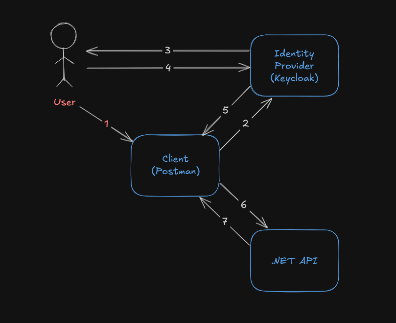

# .NET RESTful API with JWT Authentication (OpenID Connect - OIDC)
     

This project aims to exemplify how to implement the OpenID Connect (OIDC) protocol in a .NET RESTful API to enable Authentication/Authorization using JWT.

## Featured technologies:

- [Keycloak](https://www.keycloak.org/) as Authorization Server
- .NET for the RESTful API
- PostgreSQL to store data for both the API and Keycloak
- Jason Web Tokens (JWT) for authentication/authorization of requests to the API

## Architecture Overview:

In this project we're mostly concerned with showing how to implement OIDC to allow authentication with JWT in a .NET API. The picture below explains the expected flow for a Client requesting a resource from our API:



>1 - The User wants to access a protected resource that's stored in a Resource Server (that's our .NET API) but our user is not currently authenticated.

>2 - The Client (we'll be using Postman) redirects the User to the Identity Provider (Keycloak), so he can be authenticated.
>3 - Keycloak asks the User for his credentials.

>4 - The User inputs his Username and Password on the form provided by Keycloak.

>5 - Keycloak responds with a Jason Web Token (JWT) to Postman. This Token can be used to verify the User Identity and Claims (Roles).

>6 - Postman can now request the protected resource, using the Token in the Header of the request.

>7 - The .NET application receives the request, processes the Token to validate it, then responds with the resource if authentication and authorization are successful.

## Running the application:

To run this project, you will need [Docker](https://www.docker.com/products/docker-desktop/) installed on your machine.

1.  **Start the services** by running the following command from the `src/Product-API-JWT` directory:
    ```sh
    cd src/Product-API-JWT
    docker compose up --build
    ```
    This will build the API image and start all the necessary containers (API, Keycloak, and PostgreSQL). The services will be available at the following addresses:
    * .NET API: `http://localhost:5072`
    * Keycloak Admin Console: `http://localhost:8080`

2.  **Log in to Keycloak** to verify that the `product-api` realm has been imported.
    * Username: `admin`
    * Password: `admin`

3.  **Get an Authentication Token**.
   Using Postman to request a token from Keycloak. Configure it with the following details:
    * Auth Type: `OAuth 2.0`
    * Add authorization data to: Request headers
    * Header prefix: Bearer
    * Token name: you may leave this empty
    * Grant type: Authorization Code
    * Callback URL: `https://oauth.pstmn.io/v1/callback`
    * Access Token URL: `http://localhost:8080/realms/product-api/protocol/openid-connect/token`
    * Client ID: `product-api-.net`
    * Client Secret: `thissecretshouldbestoredinasafeplace`

    You can scroll down and click the `Get Access Token` button at the end. You'll be greeted by a form to input a username and password. You can use the following or you can create a new user:
    
    * Username: admintest@test.com
    * Password: Password!1

4.  **Test the API**.
    Make a request to a protected endpoint, such as `GET /api/products/1`, including the obtained JWT in the `Authorization` header.
    ```http
    GET http://localhost:5072/api/products/1
    Authorization: Bearer <YOUR_JWT_TOKEN>
    ```

5. **Clean-up after you're done** by running the following command from the `src/Product-API-JWT` directory:
    ```
    docker compose down -v
    ```

## Disclaimers
This is primarily a portfolio project, but in a real-world application there are several strings that should be kept safe, like passwords for databases, client secrets etc. Those were purposefully left unprotected to avoid bloating the code with secret-keeping features that would only have a purpose in a real-world applications.